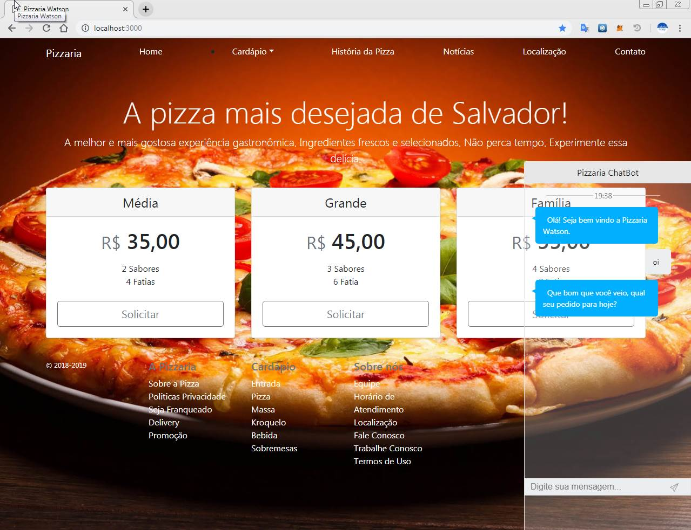

<h1 align="center" style="border-bottom: none;">Pizzaria Watson</h1>

Este aplicativo é um front-end do chatbot que usa o Watson Conversation da IBM.

Por favor, faça o seguinte:

1) Crie uma conta em https://www.bluemix.net;
2) Vá para o catálogo do Bluemix e crie um serviço de Watson Conversation;
3) Crie uma conversa do chatbot
4) Volte para o catálogo do Bluemix e crie o serviço de Continuous Delivery e segue nas etapas a seguir
5) Altere o arquivo config/bot.js com suas credenciais de Watson Conversation e Workspace id create, nas linhas:

26
27
32

como segue:

username = "xxxx-xxxx-xxxxxx-xxxx";
password = "xxxxxxxx";

conversationWorkspace = "xxx-xxxxx-xxxxx-xxxxx-xxxx";

[! [Implementar no Bluemix] (https://bluemix.net/deploy/button.png)](https://bluemix.net/deploy?repository=https://github.com/priscillaparodi/youtube-bot)

## Para executar o aplicativo localmente

1. [Instalar o Node.js] []

+ Com o prompt de comando, vá até o diretório raiz do projeto, usando cd
+ Execute `npm install` para instalar as dependências do aplicativo
+ Altere o arquivo config/bot.js e coloque as credenciais e o workspace_id da conversação nos seguintes arquivos:

username = "<username>";
password = "<password>";
conversationWorkspace = "<workspace_id>";

+ Execute o `npm start` para iniciar o aplicativo
+ Pronto acesse o aplicativo no navegador em <http://localhost:3000>

[Instalar o Node.js]: https://nodejs.org/en/